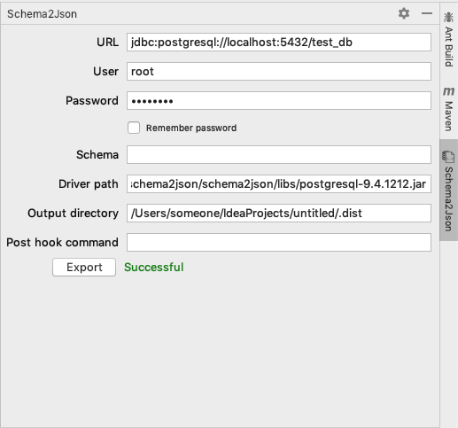

# schema2json-intelliJ-plugin

IntelliJ plugin for exporting database metadata as JSON.

## Overview

This plugin makes it possible to generate a JSON file including table names and column names, and several keys.  
Now supporting PostgreSQL/MySQL.

#### UI


#### JSON generated
```json
{
  "name" : "test_db1",
  "schema" : "public",
  "tables" : [ {
    "name" : "issues",
    "columns" : [ {
      "columnName" : "id",
      "dataType" : "BIGINT",
      "isNullable" : false
    }, {
      "columnName" : "user_id",
      "dataType" : "BIGINT",
      "isNullable" : false
    }, {
      "columnName" : "subject",
      "dataType" : "VARCHAR",
      "isNullable" : false
    }, {
      "columnName" : "description",
      "dataType" : "VARCHAR",
      "isNullable" : false
    } ],
    "primaryKeys" : [ "id" ],
    "foreignKeys" : [ "users.id:issues.user_id" ]
  }, {
    "name" : "users",
    "columns" : [ {
      "columnName" : "id",
      "dataType" : "BIGINT",
      "isNullable" : false
    }, {
      "columnName" : "account",
      "dataType" : "VARCHAR",
      "isNullable" : false
    }, {
      "columnName" : "last_name",
      "dataType" : "VARCHAR",
      "isNullable" : false
    }, {
      "columnName" : "first_name",
      "dataType" : "VARCHAR",
      "isNullable" : false
    } ],
    "primaryKeys" : [ "id" ],
    "foreignKeys" : [ ]
  } ]
}
```
